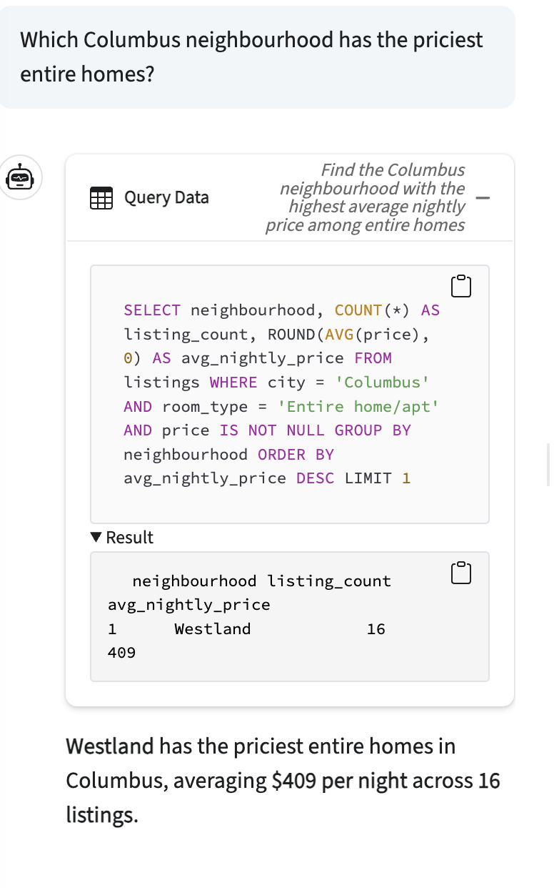
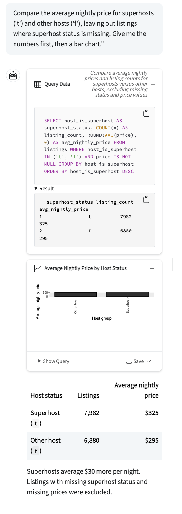
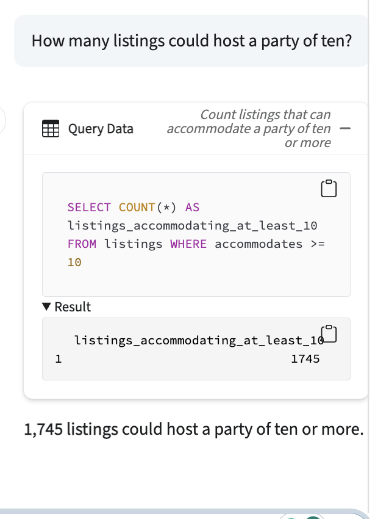

# Midwest Airbnb Explorer

**Live app:** https://business-intelligence-gzb7.onrender.com (free tier: the first request after 15 idle minutes takes about a minute)

Ask a question in plain English about 14,887 Airbnb listings in Chicago, Columbus, and the Twin Cities, and get the SQL, a table, and a chart back. Data from Inside Airbnb (Chicago 2026-07-20, Columbus 2026-07-23, Twin Cities 2026-07-21). Built by Sebastian Asander for ISA 401 at Miami University.

## Example questions

### 1. Which Columbus neighbourhood has the priciest entire homes?

### 2. Compare the average nightly price for superhosts and other hosts, leaving out listings where superhost status is missing. Give me the numbers first, then a bar chart.

### 3. How many listings could host a party of ten?
